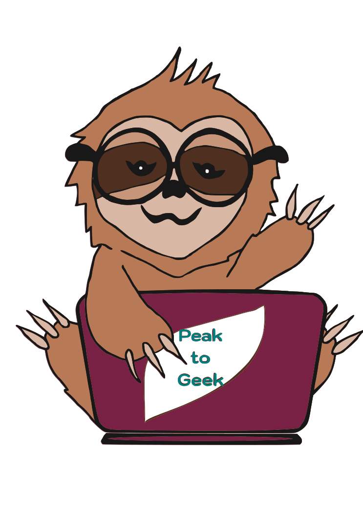

# :nerd_face: Peak to Geek

Motivational platform for IT enthusiasts! :sloth:

---

 

### Quick Links

This site was built using [Heroku](https://www.heroku.com/).

  <a href="https://peak-to-geek.herokuapp.com/">
  <!-- Link dodáme, až budeme mít nasazenou poslední verzi na Heroku + odkaz i do About na GitHubu -->
    
  </a>

---

 

[About](https://github.com/EvaMach/peak-to-geek#memo-about) •
[Tech stack/features](https://github.com/EvaMach/peak-to-geek#magic_wand-techfeatures) •
[User journey](https://github.com/EvaMach/peak-to-geek#world_map-user-journey) •
[Code example](https://github.com/EvaMach/peak-to-geek#jigsaw-code-example) •

 

## :memo: About

This project has been created within the [Digital Academy: Web](https://www.czechitas.cz/kurzy/digitalni-akademie-web) - an intensive web development [course](https://docs.google.com/spreadsheets/d/1uuo2skY2L4KZoBT-YzaN5iY02RUsiza5mgDshyJbGRI/edit#gid=1798591226) via [Czechitas](https://www.czechitas.cz/) organisation.

As the motivational IT platform it focuses on self-development in IT, regarding education, career mapping, knowledge check and gamification. The platform is based on a unique IT profile, where the users can monitor their progress in courses and knowledge.

Simply put:

- It is a place that can be used to overview one's IT knowledge necessary for certain jobs, and the progress made towards this career goal.
- This is achieved by using special checklists that are a part of guidelines to specific IT areas.
- The first such area we are focusing on within the DA project is UX / UI, while other areas (such as FE and BE development, data analysis, testing, project management etc.) are going to be continuously added afterwards.
- And since our platform is primarily motivational, there are already included some gamification elements; followed by notifications and alerts as the next step :)

## :magic_wand: Tech stack/features

- React v18
- JavaScript
- CSS

<!-- Budeme to nějak rozepisovat? -->

## :world_map: User journey

<!-- PŘIDAT GIF HÍR -->

<!-- Natočila bych user journey jako na MYM, akorát samozřejmě v aktuální verzi přímo na stránce - od přihlášení, přes klik na strom a checklisty až po přidání nového kurzu a vytvoření dashboardu/přidání kurzů na dashboard, na konec odhlášení -->

## :jigsaw: Code Example

<!-- Budeme dávat nějakou ukázku kódu? -->
